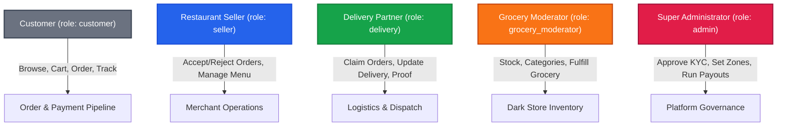
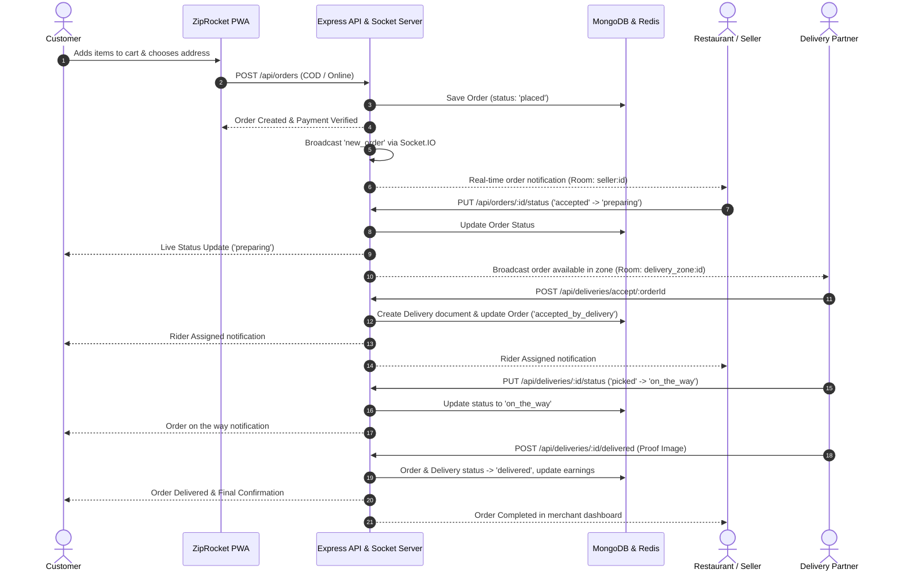
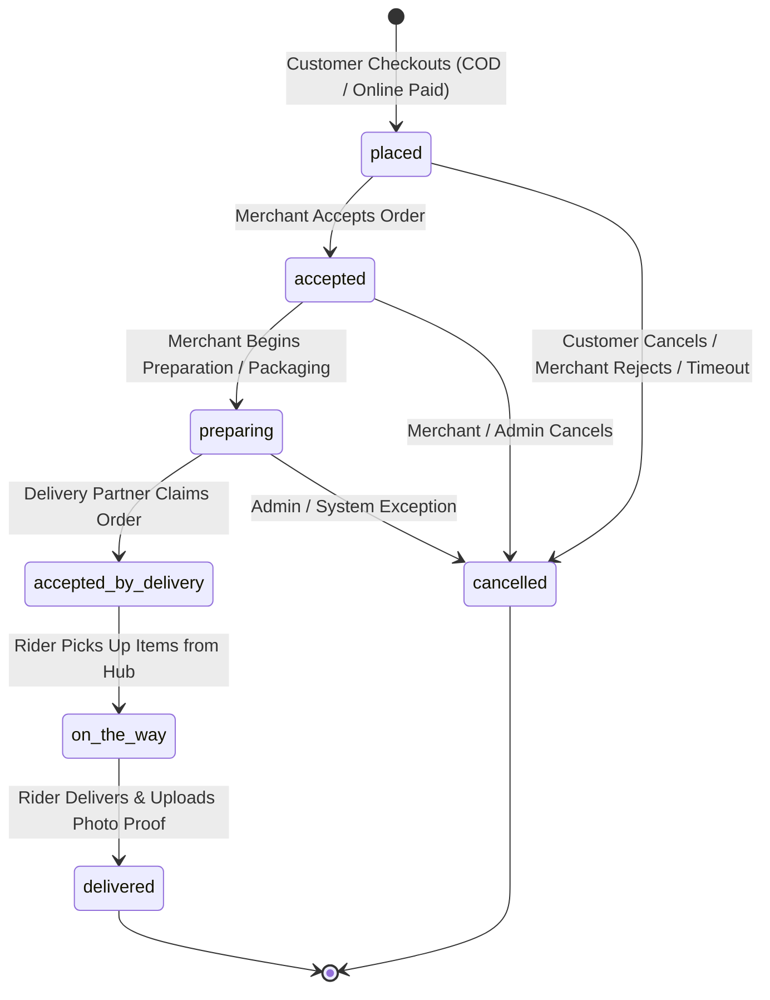
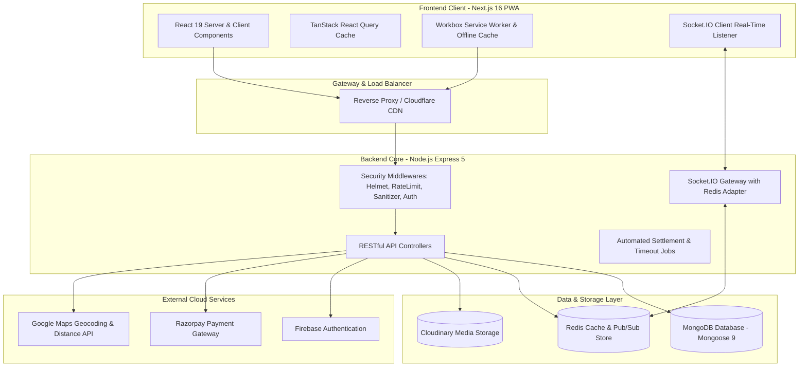
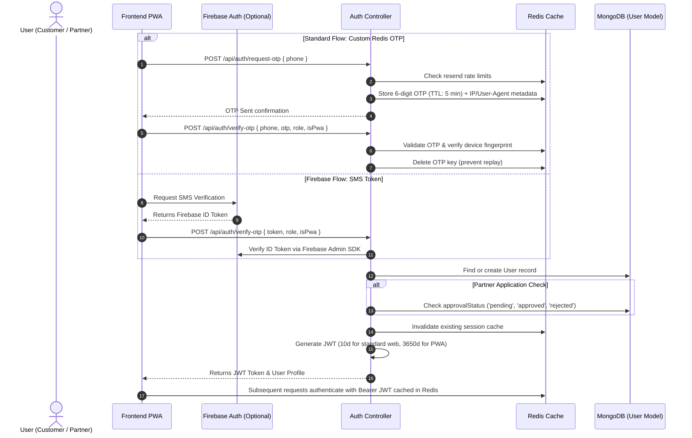
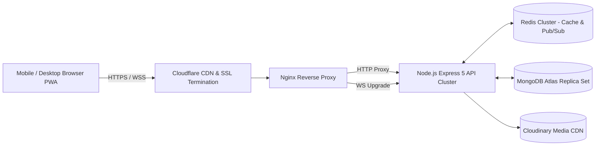

# ZipRocket — Hyperlocal Food & Grocery Delivery Platform

> **Proprietary & Confidential**  
> *Internal Engineering Documentation for Authorized Developers*

ZipRocket is a fullstack, real-time hyperlocal delivery platform specifically engineered for Tier-3 and Tier-4 cities and semi-urban markets. It bridges customers, local restaurants, grocery dark stores, and independent delivery partners through low-bandwidth Progressive Web App (PWA) clients, Redis-backed WebSockets, real-time dispatch, dynamic delivery zoning, and automated financial settlements.

---

## Table of Contents

1. [Project Overview](#1-project-overview)
2. [Problem Statement](#2-problem-statement)
3. [Key Features](#3-key-features)
4. [User Roles & Permissions](#4-user-roles--permissions)
5. [Complete Order Flow](#5-complete-order-flow)
6. [System Architecture](#6-system-architecture)
7. [Technology Stack](#7-technology-stack)
8. [Project Structure](#8-project-structure)
9. [Database Models & Schema Design](#9-database-models--schema-design)
10. [API Overview & Route Structure](#10-api-overview--route-structure)
11. [Authentication & Authorization](#11-authentication--authorization)
12. [PWA Functionality & Offline Support](#12-pwa-functionality--offline-support)
13. [Security Implementations](#13-security-implementations)
14. [Performance & Scalability Optimizations](#14-performance--scalability-optimizations)
15. [Environment Variables](#15-environment-variables)
16. [Local Development Setup](#16-local-development-setup)
17. [Running the Project](#17-running-the-project)
18. [Production Deployment Architecture](#18-production-deployment-architecture)
19. [Known Limitations](#19-known-limitations)
20. [Future Roadmap](#20-future-roadmap)

---

## 1. Project Overview

ZipRocket is designed to bring quick-commerce and restaurant delivery infrastructure to underserved semi-urban and rural clusters. The platform provides:

- **Customer Experience:** Mobile-first PWA with rapid catalog browsing, coupon redemptions, landmark/village-based address selection, live order tracking via Socket.IO, and flexible checkout (Cash on Delivery & Razorpay).
- **Merchant/Seller Portal:** Real-time incoming order audio alerts, live order acceptance/rejection, menu management, toggleable restaurant open/closed status, and earnings/settlement reporting.
- **Delivery Partner (Rider) Hub:** Real-time broadcast of available pickup requests in the rider's active delivery zone, one-click acceptance, turn-by-turn map navigation triggers, proof-of-delivery upload, and daily/weekly earnings tracker.
- **Grocery & Dark Store Management:** Dedicated moderator dashboard for managing inventory, categories, brand listings, low-stock alerts, and order packing workflows.
- **Superadmin Console:** Comprehensive oversight over platform operations, delivery zones, dynamic pricing rules (surge, base fee, small order fees), payout generation, and seller/rider verification.

---

## 2. Problem Statement

Hyperlocal delivery in Tier-3 and Tier-4 towns faces distinct logistical, behavioral, and infrastructural challenges that mainstream urban delivery apps fail to address:

1. **Unstructured Addresses & Weak Geocoding:** Traditional GPS coordinates in rural areas often fail because roads lack numbered street signs, requiring reliance on landmarks, mohallas, and villages.
2. **Network Volatility & Low-End Hardware:** Intermittent 3G/4G connectivity requires aggressive client-side caching, small bundle payloads, resilient WebSocket reconnection, and offline graceful degradation.
3. **Unit Economics & Custom Distance Radii:** Deliveries span longer distances across uneven town boundaries, requiring zone-based pricing, small order thresholds, and platform fees to protect margins.
4. **Frictionless Onboarding & Trust:** Customers prefer phone-number-based OTP logins without passwords, paired with COD payment options and transparent WhatsApp order fallbacks.

---

## 3. Key Features

- **Real-Time Bidirectional Dispatch:** Socket.IO integrated with a Redis Pub/Sub adapter to instantly propagate order creation, status transitions, and delivery assignments across isolated rooms.
- **Tier-3 Geocoding & Address System:** Address engine capturing house/shop details, landmarks, village names, and geographical coordinates with radius checks.
- **Dynamic Delivery Zone Engine:** Configure custom delivery zones with dedicated base fees, per-km rates beyond threshold, free delivery minimums, small order penalties, GST, packaging charges, and surge multipliers.
- **Automated Weekly Financial Settlements:** Payout calculation engine aggregating weekly gross sales, COD collected, platform commission deductions, and net payouts for restaurants and riders.
- **Dual-Verification Authentication:** Supports client-side Firebase Phone OTP alongside a custom backend Redis-managed OTP engine with rate limiting and device fingerprint validation.
- **Offline-First PWA Architecture:** Service Worker caching strategies powered by Workbox, full standalone installability, dynamic asset caching, and offline fallback routing.
- **Multi-Level Media Processing:** Cloudinary integration using in-memory Multer buffers and Streamifier for menu photos, restaurant banners, grocery catalogs, and delivery proofs.

---

## 4. User Roles & Permissions



### Role Breakdown

| Role | Database Identifier | Key Permissions & Capabilities |
| :--- | :--- | :--- |
| **Customer** | `customer` | Browse restaurants/grocery catalogs, manage cart, apply coupons, place COD/Online orders, track real-time status, manage saved rural addresses. |
| **Restaurant / Seller** | `seller` | Manage restaurant profile, toggle open/close status, add/edit menu items & categories, receive live order alerts, accept/reject orders, view weekly sales & payouts. |
| **Delivery Partner** | `delivery` | Submit KYC documentation, toggle active duty, receive order broadcast in assigned delivery zone, accept order, update transit states, submit delivery proof photo. |
| **Grocery Moderator** | `grocery_moderator` | Manage dark-store products, categories, subcategories, stock levels, featured badges, and monitor localized grocery orders. |
| **Administrator** | `admin` | Full platform control: approve/reject seller and delivery partner applications, configure delivery zones and pricing algorithms, view system telemetry, manage banner promotions, trigger settlement payouts. |

---

## 5. Complete Order Flow

### 5.1 System Interaction Diagram



### 5.2 Order State Transition Matrix



*Note: Only state transitions verified in `Order.ts` and `orderController.ts` are shown.*

---

## 6. System Architecture



---

## 7. Technology Stack

### Frontend Application (`/client`)
- **Framework:** Next.js 16.2.4 (App Router)
- **Library:** React 19.2.4 & React DOM 19.2.4
- **Language:** TypeScript 5
- **Styling:** Tailwind CSS v4 with PostCSS
- **State & Data Fetching:** `@tanstack/react-query` v5.101.4, Axios v1.16.0
- **Real-Time Communication:** `socket.io-client` v4.8.3
- **Authentication:** Firebase Client SDK v12.14.0 (Phone Auth)
- **PWA & Offline Management:** `@ducanh2912/next-pwa` v10.2.9, Workbox Runtime Caching
- **Icons & UI Utilities:** `react-icons` v5.7.0, `critters` CSS inliner

### Backend API Server (`/server`)
- **Runtime & Framework:** Node.js, Express v5.2.1
- **Language:** TypeScript v6.0.3 executed via `ts-node` and compiled via `tsc`
- **Database ORM:** Mongoose v9.5.0 with MongoDB
- **Caching & Message Broker:** `ioredis` v5.11.1, `@socket.io/redis-adapter` v8.3.0
- **Real-Time Engine:** Socket.IO v4.8.3
- **Payment Processing:** Razorpay Node SDK v2.9.6
- **Auth & Identity:** Firebase Admin SDK v13.10.0, `jsonwebtoken` v9.0.3
- **File Uploads & CDN:** Cloudinary v2.10.0, Multer v2.1.1, Streamifier v0.1.1
- **Security & Rate Limiting:** Helmet v8.2.0, `express-rate-limit` v8.5.2, `rate-limit-redis` v5.0.0
- **Validation:** Zod v4.4.3

---

## 8. Project Structure

```
ziprocket1/
├── package.json               # Root monorepo workspace runner (concurrent dev runner)
├── client/                    # Next.js Frontend Application & PWA
│   ├── public/
│   │   ├── manifest.json      # PWA Web App Manifest
│   │   ├── icon-192x192.png   # PWA Icon (192px)
│   │   ├── icon-512x512.png   # PWA Icon (512px)
│   │   └── sounds/            # Order notification alert chimes
│   ├── src/
│   │   ├── app/               # Next.js App Router Pages
│   │   │   ├── addresses/     # Saved rural address manager
│   │   │   ├── admin/         # Superadmin operations, finance & zone controls
│   │   │   ├── auth/          # Customer / Partner OTP login & registration
│   │   │   ├── cart/          # Cart review & coupon selection
│   │   │   ├── checkout/      # Address verification, payment selector & order creation
│   │   │   ├── delivery/      # Delivery partner live task dashboard & earnings
│   │   │   ├── grocery/       # Quick-commerce grocery storefront & categories
│   │   │   ├── moderator/     # Dark-store inventory & product management
│   │   │   ├── offline/       # Offline fallback view
│   │   │   ├── orders/        # Order history & live tracking view
│   │   │   ├── restaurants/   # Food restaurant listings, menus & details
│   │   │   ├── search/        # Universal search (food items, restaurants, groceries)
│   │   │   ├── seller/        # Merchant dashboard, live orders & menu manager
│   │   │   ├── layout.tsx     # Root shell, providers & global navigation
│   │   │   └── page.tsx       # Homepage with banner ads, categories & recommendations
│   │   ├── components/        # Reusable UI widgets, modals, headers & navbars
│   │   ├── context/           # React Contexts (Auth, Cart, PWA, Platform, Socket)
│   │   ├── hooks/             # Custom React hooks (useOrderSocket, useLocation, etc.)
│   │   ├── lib/               # QueryClient, utilities & helpers
│   │   └── services/          # API Axios clients, Firebase auth & Socket.io client
│   ├── next.config.ts         # Next.js build config, PWA rules & asset caching
│   └── package.json
│
└── server/                    # Express 5 Backend REST & Socket Server
    ├── server.ts              # Entry point: HTTP server initialization & Socket.IO mounting
    ├── src/
    │   ├── app.ts             # Express app setup, security middlewares & route mounting
    │   ├── config/            # DB connection, Cloudinary & Firebase Admin initialization
    │   ├── constants/         # App constants, error definitions & pricing rules
    │   ├── controllers/       # Business logic controllers (Orders, Payouts, Zones, etc.)
    │   ├── jobs/              # Scheduled jobs (Order auto-cancellation timeouts)
    │   ├── middlewares/       # Auth guards, RBAC, RateLimiters, Helmet, NoSQL/XSS sanitizers
    │   ├── models/            # Mongoose Schema definitions (17 Models)
    │   ├── routes/            # Express route declarations (18 Router modules)
    │   ├── services/          # Redis caching, Socket.IO emitter, Cloudinary, Razorpay, Geocoding
    │   ├── types/             # Shared TypeScript interfaces & definitions
    │   ├── utils/             # Loggers, normalization helpers & distance formulas
    │   └── validators/        # Zod input validation schemas
    ├── package.json
    └── tsconfig.json
```

---

## 9. Database Models & Schema Design

The MongoDB database is organized into 17 strongly-typed Mongoose models:

| Model | File | Primary Responsibility & Indexed Fields |
| :--- | :--- | :--- |
| **`User`** | `models/User.ts` | Multi-role user identity, phone verification, addresses, wallet balance, cancellation counts, assigned zones. Indexed by phone, role, cancellation count, and fulltext search. |
| **`Restaurant`** | `models/Restaurant.ts` | Merchant profile, cuisines, location coordinates, delivery zone, bank account, FSSAI/PAN records, ratings, availability status. Indexed by owner, deliveryZone, and text search. |
| **`MenuItem`** | `models/MenuItem.ts` | Food menu catalog with category, price, discount price, dietary tags (veg/non-veg), stock, and Cloudinary image assets. |
| **`GroceryProduct`** | `models/GroceryProduct.ts` | Dark-store quick-commerce inventory with stockQuantity, weight/unit, category, subcategory, brand, and search text indexing. |
| **`DeliveryProfile`** | `models/DeliveryProfile.ts` | Rider vehicle information (bike/scooter/e-bike), Aadhaar/PAN, driving license, bank account, assigned delivery zone, and ratings. |
| **`DeliveryZone`** | `models/DeliveryZone.ts` | Dynamic geofenced zone defining center coordinates, radius (km), base fees, per-km charges, free-delivery threshold, small order fees, GST %, packaging, and surge multipliers. |
| **`Order`** | `models/Order.ts` | Core order entity tracking items, total amount, delivery fee, payment method (COD/ONLINE), payment status, order status (`placed` through `delivered`), rural delivery address, and coupon discounts. |
| **`Delivery`** | `models/Delivery.ts` | Delivery task tracking rider assignment, transit states (`assigned`, `picked`, `on_the_way`, `delivered`), rider earnings, and photo proof of delivery. |
| **`Payout`** | `models/Payout.ts` | Weekly merchant/rider settlement ledger capturing total orders, gross sales, COD collected, platform commission, net payout amount, and audit logs. |
| **`Payment`** | `models/Payment.ts` | Razorpay transaction tracking: `orderId`, `razorpayPaymentId`, `razorpaySignature`, payment status, and verification metadata. |
| **`PlatformSettings`** | `models/PlatformSettings.ts` | Global operational switches: store open/closed, maintenance mode, operating hours (`08:00` to `22:00`), and grocery status. |
| **`Cart`** | `models/Cart.ts` | Persistent shopping cart with items, restaurant lock (prevents multi-restaurant basket collisions), and guest-to-user transfer logic. |
| **`Coupon`** & **`CouponUsage`** | `models/Coupon.ts` | Discount voucher engine supporting percentage or flat discounts, min order values, max discount limits, per-user usage limits, and expiration dates. |
| **`Address`** | `models/Address.ts` | Specialized rural address book storing house number, street, locality, village, landmark, coordinates, and delivery instructions. |
| **`BannerAd`** | `models/BannerAd.ts` | Marketing banner promotions displayed on the homepage with click actions and active date windows. |
| **`Review`** | `models/Review.ts` | Ratings and reviews for restaurants and delivery partners. |

---

## 10. API Overview & Route Structure

The backend exposes structured REST endpoints mounted under `/api`:

```
/api
├── /auth              # Request OTP, Verify OTP (Firebase & Redis), Refresh Token, Logout
├── /admin             # Platform statistics, user bans, KYC approvals, order management
├── /admin/payouts     # Payout generation, status updates, settlement history
├── /restaurants       # Public restaurant listings, menu endpoints, seller management
├── /orders            # Order creation, order tracking, status updates, cancellations
├── /deliveries        # Rider dashboard, order acceptance, status progression, proof upload
├── /delivery-zones    # Delivery zone calculation, zone CRUD, geofence checks
├── /grocery           # Quick commerce catalog, moderator CRUD, category listings
├── /cart              # Cart sync, add/remove items, clear cart
├── /coupons           # Coupon validation, discount estimation, coupon management
├── /payments          # Razorpay order generation & HMAC signature verification
├── /addresses         # Saved rural addresses (CRUD)
├── /locations         # Geocoding reverse lookup & address suggestions
├── /search            # Universal search for food items, dishes, and grocery products
├── /recommendations   # AI/Heuristic recommendations based on popular orders
├── /promotions        # Active banner advertisements
├── /platform          # Operational status, operating hours, emergency closure toggle
└── /applications      # Seller & Delivery partner onboarding applications
```

---

## 11. Authentication & Authorization

### 11.1 Authentication Flow



### 11.2 Role-Based Access Control (RBAC)
- All protected routes pass through `protect` middleware (`server/src/middlewares/authMiddleware.ts`).
- Decoded JWT IDs are checked against the Redis session cache first for ultra-fast validation without hitting MongoDB.
- Specific routes enforce authorization using `authorize("admin")`, `authorize("seller", "admin")`, `authorize("delivery")`, or `authorize("grocery_moderator", "admin")`.
- Partner accounts (`seller`, `delivery`) in `pending` or `rejected` status are blocked from accessing operational endpoints until approved by an administrator.

---

## 12. PWA Functionality & Offline Support

ZipRocket is engineered as an offline-capable Progressive Web App with fine-grained caching strategies via `@ducanh2912/next-pwa` and Workbox:

1. **Installation & Display:** Fullscreen/standalone mobile app experience (`display: "standalone"`, theme color `#FF5C00`, portrait lock).
2. **Persistent Sessions:** Standalone PWA users receive a long-lived JWT token (up to 10 years) to avoid disruptive logouts on mobile devices.
3. **Caching Strategies:**
   - **Google Fonts & Webfonts:** `StaleWhileRevalidate` and `CacheFirst` (1-year retention).
   - **Cloudinary & Unsplash Media:** `CacheFirst` with a 30-day expiration and 100-entry max.
   - **Public Catalogs (`/api/restaurants`, `/api/grocery`, `/api/delivery-zones`):** `NetworkFirst` strategy with a 5-second network timeout fallback. Sensitive routes (auth, payments, cart, orders) are strictly excluded from service worker caching.
   - **Static Assets (`.js`, `.css`, `.png`, `.svg`):** `StaleWhileRevalidate` (30-day retention).
   - **Document Navigation:** `NetworkFirst` with dynamic fallback to `/offline` when disconnected.
4. **PWA Context & Update Prompts:** React `PwaContext` provides real-time detection of online/offline status, deferred installation prompt handling (`beforeinstallprompt`), and non-intrusive update notifications when a new service worker version is deployed.

---

## 13. Security Implementations

- **HTTP Security Headers (Helmet):** Configured Content Security Policy (CSP), Strict-Transport-Security (HSTS), X-Content-Type-Options (`nosniff`), and frameguard protection against clickjacking.
- **Multi-Tier Rate Limiting:**
  - `globalLimiter`: 1000 requests per 15 minutes across all routes.
  - `otpRequestLimiter`: Strict 5 requests per 15 minutes on OTP creation.
  - `otpVerifyLimiter`: 10 verification attempts per 15 minutes to block brute-force attempts.
  - `authLimiter`: 30 auth requests per 15 minutes.
  - `apiLimiter`: 100 requests per minute for active browsing.
  - Backed by Redis via `rate-limit-redis`.
- **NoSQL Injection Sanitizer:** Middleware recursively inspects `req.body`, `req.query`, and `req.params` to sanitize keys starting with `$` or containing `.` characters.
- **XSS Prevention:** Strips executable JavaScript tags, HTML attributes, and event handlers from incoming string payloads.
- **Razorpay Signature Verification:** HMAC-SHA256 hash validation on `razorpay_order_id + "|" + razorpay_payment_id` against the secret key before marking payments as successful.
- **Strict Payload Limits:** Express body parser configured to `10kb` limit to prevent payload flooding / Denial-of-Service attacks.
- **Reverse Proxy IP Resolution:** Configured `app.set("trust proxy", 1)` ensuring rate limiters read true client IPs when deployed behind reverse proxies.

---

## 14. Performance & Scalability Optimizations

- **Redis Multi-Layer Caching:**
  - **Session Cache:** Caches user profiles to eliminate repetitive database lookups on authenticated requests.
  - **OTP Cache:** Caches transient OTP codes and request metadata.
  - **Restaurant & Zone Cache:** Caches active delivery zones and restaurant listings with automatic invalidation on updates.
- **Optimized MongoDB Indexing:**
  - Compound indexes on orders: `{ restaurant: 1, orderStatus: 1, createdAt: -1 }`, `{ user: 1, createdAt: -1 }`.
  - Fulltext indexes for fuzzy search on restaurants (`name`, `cuisines`, `address`) and grocery items (`name`, `brand`, `category`).
  - Geospatial and compound indexes on delivery zones and partner profiles.
- **Socket.IO Redis Adapter:** Enables horizontal scaling of backend Node.js instances across multiple processes or container nodes without losing WebSocket room messages.
- **Next.js & Asset Optimization:**
  - Automated AVIF and WebP image generation with custom device sizes.
  - `optimizePackageImports` for Firebase modular imports.
  - CSS inlining via `critters` and response compression.

---

## 15. Environment Variables

### 15.1 Backend Server (`server/.env`)

| Variable Name | Purpose / Description |
| :--- | :--- |
| `PORT` | Port number on which the Express HTTP server listens (Default: `5000`). |
| `NODE_ENV` | Application environment (`development` or `production`). |
| `CLIENT_URL` | Frontend origin URL for CORS validation and Socket.IO origin checks. |
| `MONGODB_URI` | MongoDB connection connection string. |
| `JWT_SECRET` | Secret key used to sign and verify JSON Web Tokens. |
| `REDIS_ENABLED` | Toggle Redis integration (`true` or `false`). |
| `REDIS_HOST` | Hostname or IP address of the Redis instance. |
| `REDIS_PORT` | Port number for Redis (Default: `6379`). |
| `REDIS_PASSWORD` | Password for authenticated Redis connections (optional). |
| `FIREBASE_PROJECT_ID` | Project identifier for Firebase Admin SDK. |
| `FIREBASE_CLIENT_EMAIL` | Service account client email for Firebase Admin SDK. |
| `FIREBASE_PRIVATE_KEY` | Service account private key for Firebase Admin SDK. |
| `CLOUDINARY_URL` | Cloudinary connection URI for media uploads. |
| `Test_PAYMENT_API_KEY` | Razorpay Key ID for payment order creation. |
| `Test_PAYMENT_SECRET_KEY` | Razorpay Secret Key for HMAC signature verification. |
| `GOOGLE_MAPS_API_KEY` | Google Maps API key for geocoding and distance matrix lookups. |
| `LOG_LEVEL` | Logging verbosity (`debug`, `info`, `warn`, `error`). |

### 15.2 Frontend Client (`client/.env.local`)

| Variable Name | Purpose / Description |
| :--- | :--- |
| `NEXT_PUBLIC_API_URL` | Base URL of the backend Express REST API (e.g. `http://localhost:5000/api`). |
| `NEXT_PUBLIC_SOCKET_URL` | Base URL of the Socket.IO server (e.g. `http://localhost:5000`). |
| `NEXT_PUBLIC_FIREBASE_API_KEY` | Firebase Web API Key for client-side phone auth. |
| `NEXT_PUBLIC_FIREBASE_AUTH_DOMAIN` | Firebase Auth domain. |
| `NEXT_PUBLIC_FIREBASE_PROJECT_ID` | Firebase project ID. |
| `NEXT_PUBLIC_FIREBASE_STORAGE_BUCKET` | Firebase storage bucket name. |
| `NEXT_PUBLIC_FIREBASE_MESSAGING_SENDER_ID` | Firebase Cloud Messaging sender ID. |
| `NEXT_PUBLIC_FIREBASE_APP_ID` | Firebase Web Application ID. |
| `NEXT_PUBLIC_FIREBASE_MEASUREMENT_ID` | Google Analytics / Firebase Measurement ID. |

---

## 16. Local Development Setup

### Prerequisites
- **Node.js:** v20.x or higher
- **npm:** v10.x or higher
- **MongoDB:** Running instance (Local or MongoDB Atlas)
- **Redis Server:** Running instance (Local or Redis Cloud)

### Installation Steps

1. **Clone the repository:**
   ```bash
   git clone <private-repository-url>
   cd ziprocket1
   ```

2. **Install Root Dependencies:**
   ```bash
   npm install
   ```

3. **Install Backend Dependencies:**
   ```bash
   cd server
   npm install
   ```

4. **Install Frontend Dependencies:**
   ```bash
   cd ../client
   npm install
   ```

5. **Configure Environment Files:**
   - Create `server/.env` based on the variables listed in Section 15.1.
   - Create `client/.env.local` based on the variables listed in Section 15.2.

---

## 17. Running the Project

### Running Both Client and Server Concurrently (Recommended)
From the root workspace directory:
```bash
npm run dev
```

### Running Server Independently
```bash
cd server
npm run dev
```
The server will start on `http://localhost:5000` with nodemon and ts-node.

### Running Client Independently
```bash
cd client
npm run dev
```
The frontend will start on `http://localhost:3000`.

### Building for Production Verification
```bash
# Compile backend TypeScript
cd server
npm run build

# Compile frontend Next.js bundle
cd ../client
npm run build
```

---

## 18. Production Deployment Architecture



### Deployment Configuration Guidelines
- **Process Management:** Use PM2 or Docker containers to manage Node.js processes with cluster mode.
- **Nginx WebSocket Upgrade:** Ensure `proxy_set_header Upgrade $http_upgrade` and `proxy_set_header Connection "upgrade"` are set for `/socket.io/`.
- **Static Asset Caching:** Configure long-term cache headers (`Cache-Control: public, max-age=31536000, immutable`) for `/_next/static/`.

---

## 19. Known Limitations

- **Single Delivery Partner Assignment:** Currently, delivery broadcast is published to the zone room and claimed on a first-come-first-served basis by the first rider who accepts, rather than multi-tier automated algorithmic batching.
- **Single-Zone Delivery Boundaries:** Orders cannot cross multiple delivery zones; both merchant and customer must fall within the designated operational radius of the same delivery zone.
- **In-Memory Order Timeout Job:** Auto-cancellation timeouts for unacknowledged orders run via timer intervals within the Node process, which requires Redis key expiration hooks or BullMQ for distributed cluster setups.

---

## 20. Future Roadmap

- **Intelligent Dispatch Routing (Batching):** Multi-order batching allowing riders to pick up multiple food or grocery orders heading in the same village direction.
- **WhatsApp Bot Integration:** Automated WhatsApp notifications sending live tracking URLs and order updates to customers with low app engagement.
- **Offline Order Drafting:** Allow customers with zero connectivity to compile orders offline and auto-submit when connectivity resumes.
- **Multilingual UI Support:** Native Hindi and regional language toggles tailored for Tier-3/Tier-4 customer accessibility.
- **Automated Payout Disbursals:** Direct bank transfer integrations via RazorpayX / IMPS payouts to automate weekly settlements directly from the admin console.

---

*This document is maintained by the ZipRocket Core Engineering Team. For questions or architecture clarification, contact the project maintainers.*
